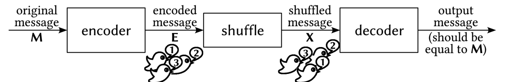
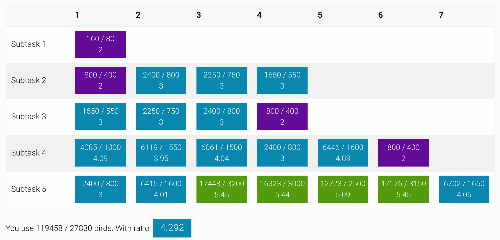
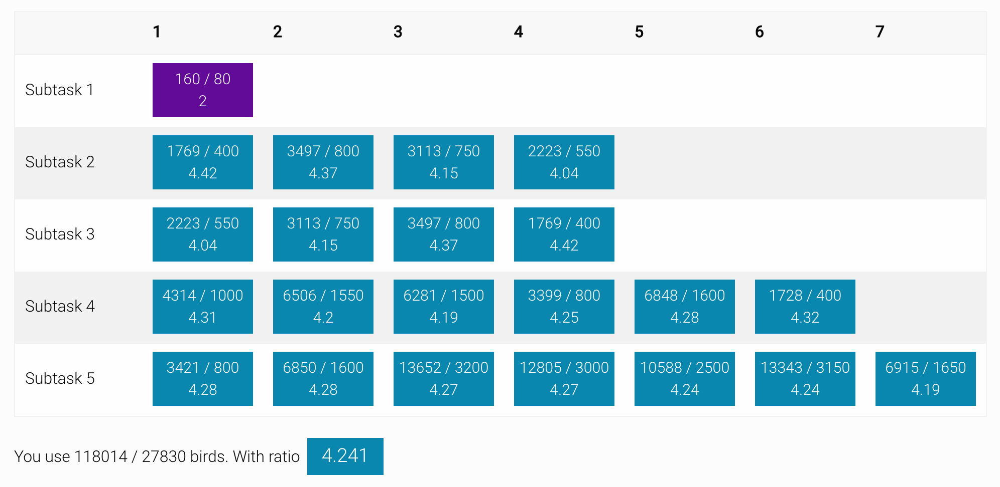
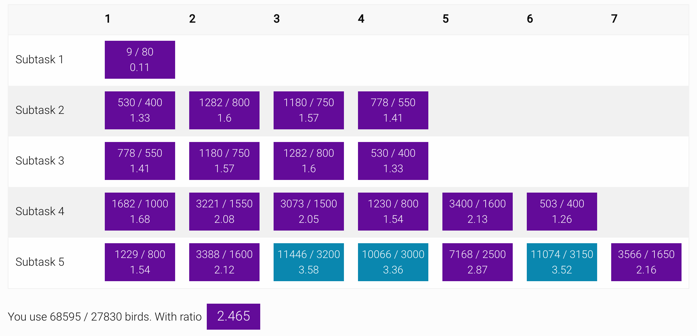

Parrots Algorithm Solution
===

My solution for 2110327 algorithm design class, the task is original from IOI 2011 names parrots. A task about designing an encoding and decoding algorithm as optimized as you can.



## Problem

You can read the original task in [parrots_task.pdf](parrots_task.pdf)<br>
The parrots task is original by [International Olympiad in Informatics 2011](ioi2011.or.th).

The summarize of the task is

1. Try to design the program that
receive the N `Original Message` numbers
(Where the N <= 64 and each message has 0 - 255 range)
2. `Encode` the original N messages to another message sequence, it's called `Encoded Message`
(*Encoded message* must be in 0 - 255 range) with limit the size
of message must not exceed 15N (Some test case limited with 10N).
3. The encoded message from (2) will be shuffled.
4. Receive the `Shuffled Message` from (3) and `Decode` back to `Original Message`

For more easy understanding look the figure below.


You must implement the `Encode` and `Decode` process with you own method. But the *shuffle* part are executing by judging program and you're not able to edit/fix anything in shuffle part.

**Limitation**

There are 5 subtasks with different limitation you can see through [parrots_task.pdf](parrots_task.pdf)

For shortly version

- `Original Message`
  * Numbers of message <= 64
  * Each message contains number with 0 - 255 range.
- `Encoded Message`
  * Number of message < 10 * N (For pass every subtasks. Where N is numbers of original message)
  * Each message can hold number 0 - 255.

You program must run with result of `Ratio` < 5 in *every subtasks* for perfect scores (100/100) in IOI competition. (Where *Ratio* means numbers of *Encoded Message* divided by numbers of *Original Message*, On the other hand, *Ratio* is how less you use to *Encoded Message* compare to *Original Message*)

## Folder Structure

- `parrots_task.pdf` original task.
- `student.cpp` a file to implement encode and decode algorithm.
- `grader.cpp` judging program.
- `solution/` all my solution file.
- `test/` test case subject.

## Usage

- Compile the file (The file will be located in `bin/Debug/parrot`)

```sh
$ make
```

- Testing

```sh
# Testing with sample test case
$ make test

# Testing with single test case
$ make test-one

# Testing with more debugging information
$ make test-verbose

# Testing with real subject
$ make test-real

# Testing with report version
$ make test-report
```

You are freely to customize the sample test case in `Makefile`<br>
The report version are can be converted to easily graphics version using [https://github.com/neungkl/parrots-score-calculation](https://github.com/neungkl/parrots-score-calculation)

## Solution

Special Thanks to [Public Solution](http://www.ioinformatics.org/locations/ioi11/contest/hsc/tasks/solutions/parrots.pdf) for this implementation.

### Solution I : Bit Reducing

Source code provided in `solution/student-bit-reduce.cpp`

**For N <= 8**

I convert the number to binary number and splitting to 2 parts.
Head 4-bits number and Tail 4-bits number.

```
10001010 -> 1000 1010
11111111 -> 1111 1111
```

For *Encoded Message* each message contains the position of original message and data.

Where first 3-bits of encoded message is position.

```
0) 10001010 -> Encoded Message = 000 XXXXX
1) 11111111 -> Encoded Message = 001 XXXXX
2) 10101010 -> Encoded Message = 010 XXXXX
3) 00000000 -> Encoded Message = 011 XXXXX
...
7) 10101010 -> Encoded Message = 111 XXXXX
```
And the problem is how we represent the 8-bits data message to 5-bits encoded message.

Do you remember the splitting that I tell you before. If give bit 4 position of encoded message to represent it's a head or tail and the other bits is data.

```
                                    Head        Tail
0) 10001010 -> Encoded Message = 000 0 1000, 000 1 1010
1) 11111111 -> Encoded Message = 001 0 1111, 001 1 1111
2) 10101111 -> Encoded Message = 010 0 1010, 010 1 1111
3) 00000000 -> Encoded Message = 011 0 0000, 011 1 0000
```

The ratio of this way is 2. But I still has a problem is N >= 8.

**For N <= 16**

Similar to previous method. But you must use 4-bits of represent the position of original message.

```
0) 10001010 -> Encoded Message = 0000 XXXX
1) 11111111 -> Encoded Message = 0001 XXXX
2) 10101010 -> Encoded Message = 0010 XXXX
3) 00000000 -> Encoded Message = 0011 XXXX
...
15) 00011110 -> Encoded Message = 1111 XXXX
```

But how I use 4 bits for data message. The key is how many times of sending message.<br>
We can sending 4-bits data for the tail part.<br>
And sent 2 times for data in the head.<br>

```
                                       Head           |    Tail
0) 10001010 -> Encoded Message = 0000 1000, 0000 1000 | 0000 1010
1) 11111111 -> Encoded Message = 0001 1111, 0001 1111 | 0001 1111
2) 10101111 -> Encoded Message = 0010 1010, 0010 1010 | 0010 1111
3) 00000000 -> Encoded Message = 0011 0000, 0011 0000 | 0011 0000
```

**For <= 32**

Now it's harder. First we construct the table with the row stands for position of message
and the column is position of bit.

```
    0 | 1 | 2 | 3 | 4 | 5 | 6 | 7
0)  1   0   0   0   1   0   1   0
1)  1   1   1   1   1   1   1   1
2)  1   0   1   0   1   1   1   1
3)  0   0   0   0   0   0   0   0
...
31) 0   0   1   1   0   0   1   0
```

Find the row and column position that contains 1.

```
    0 | 1 | 2 | 3 | 4 | 5 | 6 | 7
0)  1   0   0   0   1   0   1   0 -> (0,1), (0,4)
1)  1   1   1   1   1   1   1   1 -> (1,0), (1,1), (1,2), (1,3), (1,4), (1,5), (1,6), (1,7)
2)  1   0   1   0   1   1   1   1 -> (2,1), (2,2), (2,4), (2,5), (2,6), (2,7)
3)  0   0   0   0   0   0   0   0
...
31) 0   0   1   1   0   0   1   0 -> (31,2), (31,3), (31,6)
```

For each pair of (X,Y) where X is row and Y is column. Now we convert to encoded message
by using 5 bits for X and 3 bits for Y

```
(0,1), (0,4) -> 00000 001, 00000 100
(2,4), (2,5) -> 00010 100, 00010 101
(31,2), (31,3), (31,6) -> 11111 010, 11111 011, 1111 110
```

**For <= 64**

Extended from *N <= 32* algorithm but customize with *N <= 16* version.
But this version is not divide the data to the head and tail, but divide by first 32 numbers and last numbers.

```
Sent 1 time
=================================
    0 | 1 | 2 | 3 | 4 | 5 | 6 | 7
0)  1   0   0   0   1   0   1   0
1)  1   1   1   1   1   1   1   1
2)  1   0   1   0   1   1   1   1
3)  0   0   0   0   0   0   0   0
...
31) 0   0   1   1   0   0   1   0

Sent 2 times
=================================
          0 | 1 | 2 | 3 | 4 | 5 | 6 | 7
32 -> 0)  0   0   1   0   1   0   1   0
33 -> 1)  1   0   1   1   0   1   1   1
34 -> 2)  1   0   1   0   0   1   1   1
35 -> 3)  0   1   1   0   0   0   0   0
...
63 -> 4)  1   0   1   1   0   0   0   0
```

Now apply *N <= 16* algorithm.

```
Sent 1 time
==============
(0,1), (0,4) -> 00000 001, 00000 100
(2,4), (2,5) -> 00010 100, 00010 101
(31,2), (31,3), (31,6) -> 11111 010, 11111 011, 1111 110

Sent 2 times
===============
(32,2), (32,6) -> 00000 010, 00000 010, 00000 110, 00000 110
(63,0), (63,2), (63,3) -> 11111 000, 11111 000, 11111 010, 11111 010, 11111 011, 11111 011
```

Implementation available in `solution/student-bit-reduce.cpp`



But this method is not good enough because the perfect score require every ratio
of subtasks must be less than 5. But these solution have some problem with subtask5
with the maximum ratio is 5.45.

### Solution II : Bijection

Source code provided in `solution/student-group-4.cpp`

I convert the sequence the message to huge number by represent the number with
256 number-base system.

```
0 10 123 255 0 4
= (0 * 256^5) + (10 * 256^4) + (123 * 256^3) + (255 * 256^2)+ (0 * 256) + 4
= 45029982212
```

I will calls *45029982212* with `Order Number`.<br>
And now I need to find a way to convert `Order Number` to `Encoded Message`
but how.

We know the fact that if the `Encoded Message` is sorted. Even we shuffle its.
We still know the original sorted pattern by sorting the shuffle message.

Now I must figure it out how I represent `Order Number`
with `Sorted Encoded Message` version.

First, I find the non-decreasing sequence pattern. Here are example of non-decreasing sequence.

```
# This is non-decreasing sequence.
3 3 2 1 0 0 0
3 2 1 0
2 2 1 0
1 1 1 1

# This is not non-decreasing sequence.
# 2 3 2 2 1
# 1 2 3
# 1 1 1 2
```

Then, we translate the combination of non-decreasing sequence to `Order Number`.
For example

```
Order Number: Non-Decreasing Sequence
0 : 0
1 : 1
2 : 2
3 : 3
4 : 0 0
5 : 1 0
6 : 1 1
7 : 2 0
8 : 2 1
9 : 2 2
10 : 3 0
11 : 3 1
12 : 3 2
13 : 3 3
14 : 0 0 0
15 : 1 0 0
16 : 1 1 0
17 : 1 1 1
18 : 2 0 0
19 : 2 1 0
20 : 2 1 1
21 : 2 2 0
22 : 2 2 1
23 : 2 2 2
24 : 3 0 0
25 : 3 1 0
26 : 3 1 1
27 : 3 2 0
28 : 3 2 1
29 : 3 2 2
30 : 3 3 0
31 : 3 3 1
32 : 3 3 2
33 : 3 3 3
```

This example, each number of non-decreasing sequence is below than 4.
If we can 3 numbers of each non-decreasing sequence. You will generate to 33 *Order Number*.

Back to the original task. Each *Encoded Message* has range 0 - 255.
So you generate the non-decreasing with each number is below than 256.

And can represent any *Order Number* with non-decreasing sequence that number < 256.
In theory, the numbers of each non-decreasing sequence that can represent the maximum
of *Order Number* of this current task is 261 numbers.

So, the ratio is hit to 261 / 64 = 4.078 and receive the perfect score.

Let's briefly explain again.

1. Convert `Original Message` to `Order Number` with 256-base number method.
2. Find `Non-Decreasing Sequence` that represent the `Order Number`
3. Sent the `Encoded Message` with `Non-Decreasing Sequence` from (2)
4. Shuffle
5. Received the `Shuffled Message` then sorting the message you will get the
original `Non-Decreasing Sequence` from (3). Because `Non-Decreasing Sequence` are
already sorted, even it's shuffled, it'll still the same if we sort the shuffled version.
6. Convert the `Non-Decreasing Sequence` to `Order Number`
7. Convert the `Order Number` to `Original Message`
8. Now you got the `Original Message`

**But...**

The problem is implementation. In C,C++ language the big-number is not supported.
(Without using external library) for implementation the `Order Number` which is
a very huge number. So, you must implement the big-number concept with your own.

But there are some another method to ignore the big-number implementation.

1. Divide 64 numbers of `Original Message` to 16 groups each group contains 4 numbers.
2. Generate the non-decreasing sequence that each number in sequence is below than 16.
3. Convert (1) in each 4 numbers to `Order Message` for each group.
4. Change the `Order Message` to `Non-Decreasing Sequence` for each group.
5. Now you got the `Non-Decreasing Sequence` with each number is below than 16.
6. Use first 4 bits the represent the group numbers and last 4 bits for `Non-Decreasing Sequence` in (5).
7. Sent the `Encoded Message` from (6)
8. Shuffle
9. Receive the message and extract to each group by extracting first 4 bits.
10. Now you got the `Non-Decreasing Sequence` of each group
11. Convert `Non-Decreasing Sequence` of each group to `Order Number`
12. Convert `Order Number` to original message of each group.
13. Convert `Order Number` to `Original Message`. Don't forget to put to correct group number.
14. You got the fully version of `Original Message` by combining each group from (13)

I using dynamic programming for implementation the `Non-Decreasing Sequence`.<br>
Full implementation available in `solution/student-group-4.cpp`

The result looks great with perfect score without using any big-number implementation.



### Solution III : To the Best of the Best

The solution II is still easy for implementation. Now I move upward to big-number
implementation.

Source code available in `solution/student-big-number.cpp`

The ratio is very good but it's take very long time to process.
The bottleneck of the program is dynamic programming algorithm that calculate
every time between encode and decode process.

So, I optimize its by given dynamic programming calculation only one time at first at program start
and another calculation using the previous value that were already calculation before.

Now, it's work. Let's see the result.


The result is incredible. The maximum ratio was hit to 3.82.

**A tricky optimization**

A little tricky optimization is handle with every number in *Original Message* is all 255.
I just sent no message for telling the *Decode* function, this is the edge test case.

And also using one encoded message for subtask 1.
(Every input in subtask 1 is 1-bit with 8 messages. So, I convert input into 8-bits message)

And some rearrange order of *Original Message*. Here the result.



This is my best ratio. I got 2 rank out of 82 in my class.
The ratio of rank 1 is less than my ratio about 0.001 (His ratio is 2.464. Mine are 2.465).

## Thanks

- 2110327 Algorithm Design Class for this challenge
- International Olympiad in Informatics 2011 : [Parrots Task](parrots_task.pdf)
- International Olympiad in Informatics 2011 : [Public Solution](http://www.ioinformatics.org/locations/ioi11/contest/hsc/tasks/solutions/parrots.pdf)
- [Score Visualizer](https://neungkl.github.io/parrots-score-calculation/)
this project is also created by me. See the [repository](https://github.com/neungkl/parrots-score-calculation).

## License

[MIT](LICENSE) © Kosate Limpongsa
